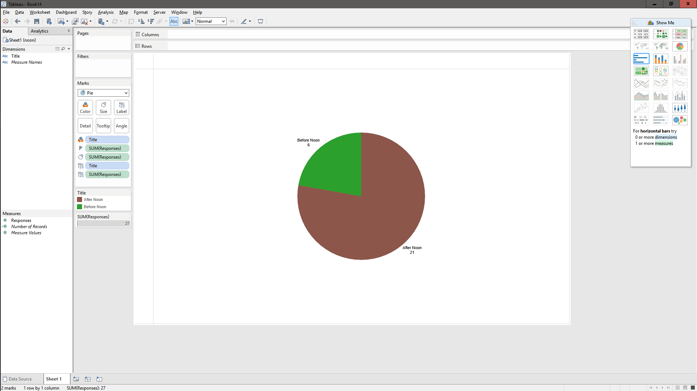

# Tableau Visualization

Tableau is arguably the biggest deal now in terms of data visualization for non-programmers.
Let's pretend you are not a programer. Learn and experience what it is like to make
visualizations using Tableau to answer the same questions about your classmates in our course.

For each of the question, think about what chart you should use to convey your answer and
make your best effort to create something that makes sense to you. There's no right
or wrong. When we meet in the class again, we will set aside time for each team to discuss
and compare the variety of visualization solutions each member has come up with for the
same set of questions. It will be fun!

To include a Tableau visualization in your report, take a screenshot, save it as an image,
put it in the `learning/week2` folder, and replace ``  with
your own image. Please makes sure your screenshot includes the _entire_ Tableau interface
including the controls, widgets ...etc.

# How big the deal Tableau really is?

Tableau has been growing by about 75% every year and reached over $412 million in 2014. They server over 26,000 customers that include huge companies such as Audi and Coca-Cola.

Source: http://diginomica.com/2015/02/05/tableau-ramps-revenues-75-adds-2600-customers/#.VezQcrNVK1E

# How many Applied Math majors are there?

Look at the right axis label to see the majors and then the bars represent how many people said they were majors in that department. Keep in mind that this double counts double majors. For example, an Applied Math and a Computer Science double major would be counted in both the first and second bar.

# How many people submitted after August 24th? (The first day of class)

A pie chart that highlights the amount of posters that made their posts after the 24th in red. The number of people in each category is also labeled.

# Who was the first person to say their favorite food was Mexican?

A Gantt Bar graph that shows all the people who commented Mexican food (includes people who said a specific mexican food) and relates a bar to a time that they posted that comment. The data is sorted in a descending order that relates posting time, so the person on top is the first commenter. The first and second commenters were only seperated by one minute, so it can be hard to tell the difference between the two.

# How many people submitted before noon?

Another pie chart that shows the amount of people who submitted their comments before noon. The sections that related to those who submitted before noon is highlighted in green.
