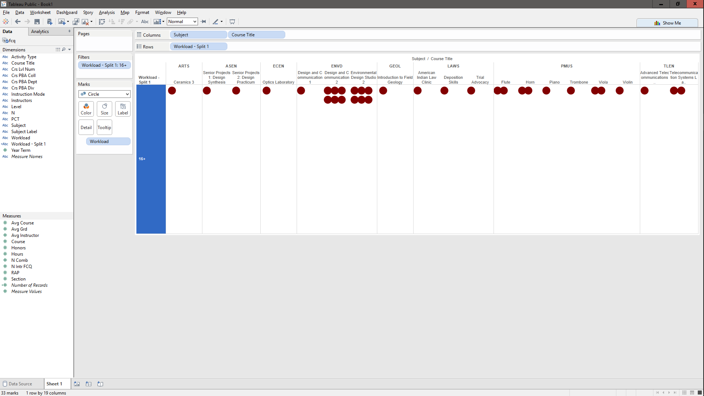
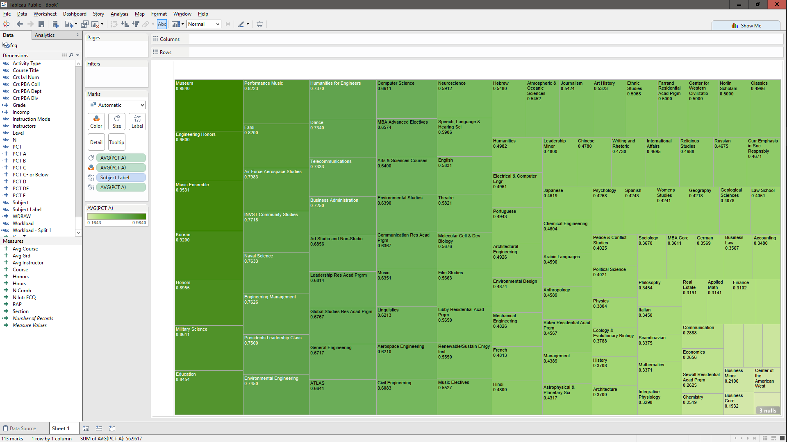
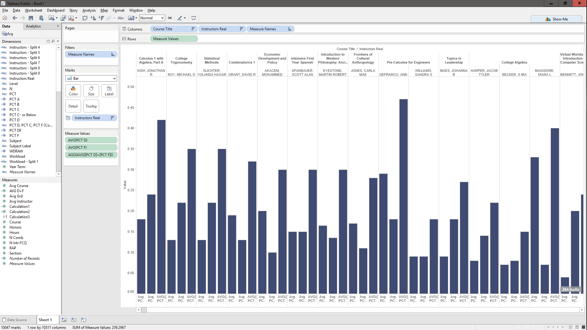
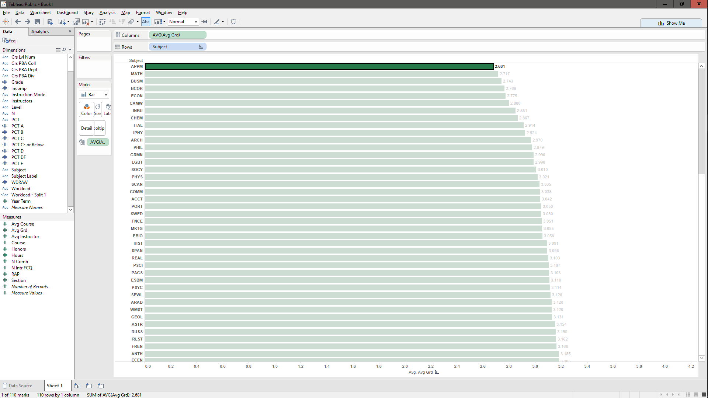

# Visualization

Using Tableau, create visualization for each question in the report. You will
work on this independently just like last week.

To include a Tableau visualization in your report, take a screenshot, save it as an image,
put it in the `learning/week2` folder, and replace ``  with
your own image. Please makes sure your screenshot includes the _entire_ Tableau interface
including the controls, widgets ...etc.

# Import

Data: [fcq.clean.json](https://github.com/bigdatahci2015/book/blob/master/hackathons/fcq/fcq.clean.json)

(a copy of this file is in your book repository already in the directory `hackathons/fcq`)

This dataset is provided to you in the JSON format. Your first task is to figure out
how to transform this JSON file into a format that can be fed into Tableau. As
a junior and senior, you are expected to be able to look around the Internet
to problem solve.

# Which classes have the highest hours of work per week? (16+) (Parker Illig)

For this question I made a graph that shows all the departments and classes inside those departments that have students put 16+ hours of work per week into. Each red circle represents a section of a particular class that has responded 16+.

# What department should I take classes in if I want to boost my GPA? (Caleb Hsu)

This tree graph represents all the departments and their respective average giveouts of A grades. Rectangles that are more saturated and larger have greater GPA's, so the maximum GPA in this graph is represented in the upper left corner, by Museum.

# Which classes(with specific professors) damaged the most students (sort by:D + F rating)? (Denis Kazakov)

This bar chart represents each class and each respective instructor of that class' average giveout of D's and F's. The first bar is Average D, then second is Average F, then third is the average of the two combined. The graph is sorted by the average of D+F.

# What department has the lowest average GPA? (Nicole Woytarowicz)

This simple bar chart shows the average GPA over each department and put the smallest one at the top. This answer shows something different from the report due to the fact that Tableau eliminated the null statements in the data and the average GPA changed due to that.

